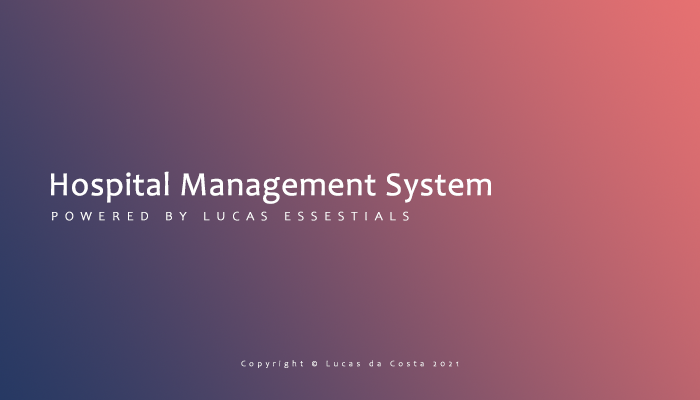

<h1 align="center">HMS - Hospital Management System</h1>

Projeto em desenvolvimento.

  <a href="#-tecnologias">Tecnologias</a>&nbsp;&nbsp;&nbsp;|&nbsp;&nbsp;&nbsp;
  <a href="#-projeto">Projeto</a>&nbsp;&nbsp;&nbsp;|&nbsp;&nbsp;&nbsp;
  <a href="#memo-licença">Licença</a>

  

 

  

## 🚀 Tecnologias

Esse projeto está sendo desenvolvido com as seguintes tecnologias:

- Windows Forms
- C#
- Git e Github

## 💻 Projeto

O HMS é um projeto que simula o formulário padrão de controle de um hospital, onde haverá máscaras em alguns inputs, utilização de diversos componentes visuais, interações com elementos gráficos, além de um banco de dados que facilitará o armazenamento das informações dos doutores, pacientes e do relatório de diagnósticos.

## :memo: Licença

Esse projeto está sob a licença MIT.
